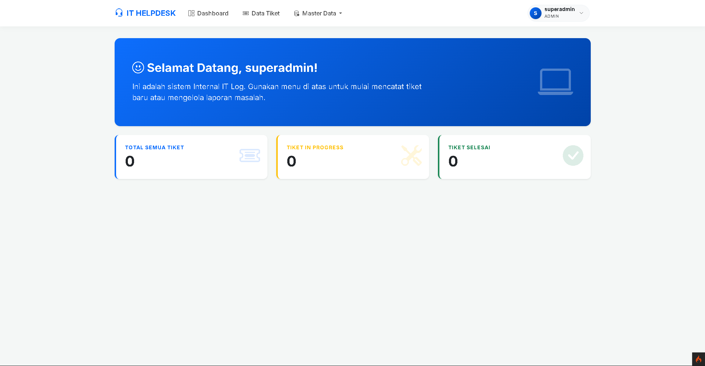
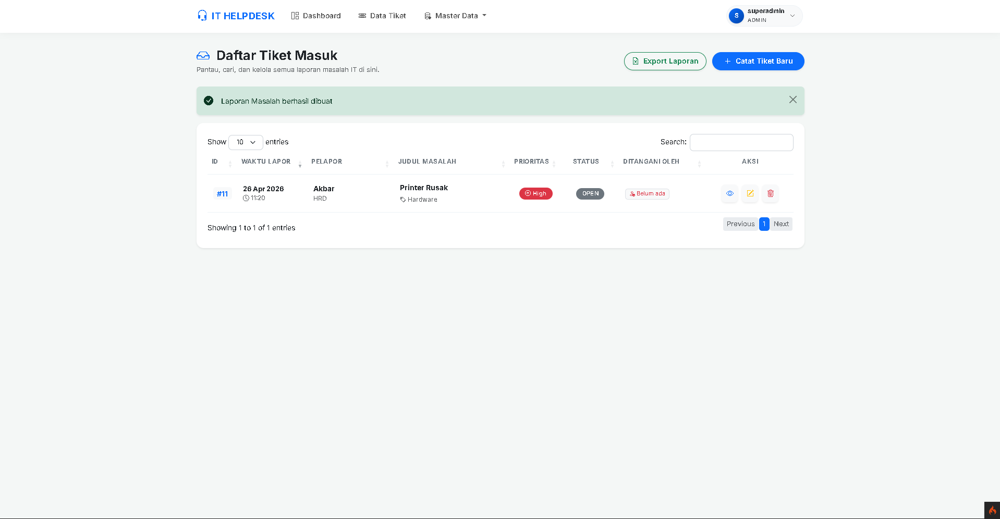
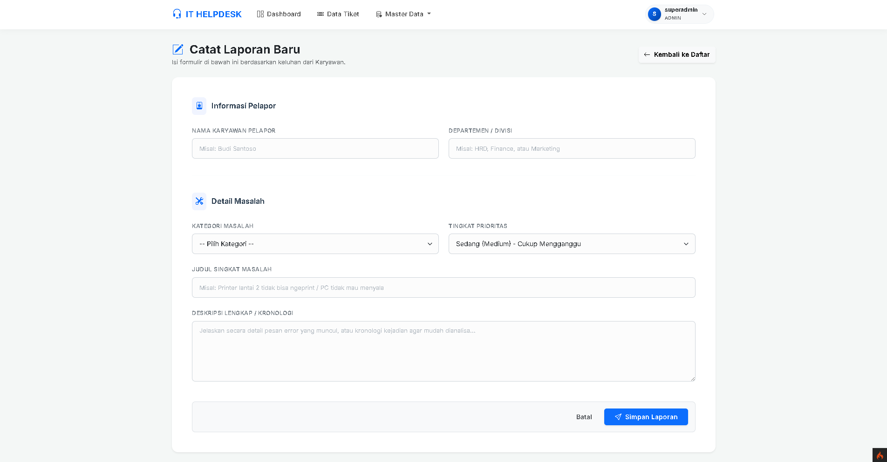
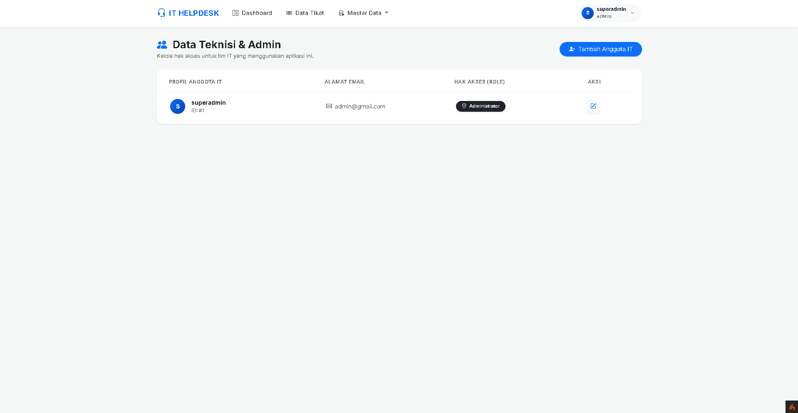

# 🛠️ IT Log & Ticketing System

Aplikasi manajemen log IT internal yang dirancang untuk mencatat, melacak, dan mengelola keluhan teknis dari staf atau karyawan secara terstruktur. Dibangun menggunakan framework **CodeIgniter 4** dan **Bootstrap 5**.

## 📸 Tampilan Aplikasi

<table style="width: 100%;">
  <tr>
    <td width="50%">
      
<b>Dashboard Utama</b>

      
    </td>
    <td width="50%">
      
<b>Daftar Tiket</b>

      
    </td>
  </tr>
  <tr>
    <td width="50%">
      
<b>Detail Catatan</b>

      
    </td>
    <td width="50%">
      
<b>Manajemen User</b>

      
    </td>
  </tr>
</table>

---

## 📋 Fitur Utama
* **Pencatatan Tiket**: Log laporan yang diterima melalui telepon, chat, atau tatap muka.
* **Manajemen Status**: Lacak progres setiap kendala (Open, In Progress, Closed).
* **Skala Prioritas**: Pengaturan tingkat urgensi keluhan (Low, Medium, High).
* **Dashboard Statistik**: Ringkasan visual jumlah tiket untuk memantau performa tim IT.
* **Manajemen User**: Pengaturan hak akses untuk admin dan teknisi.

---

## 💻 Prasyarat Sistem
* **PHP**: Versi 7.4 atau 8.x
* **Web Server**: Apache (via XAMPP / Laragon / Wampp)
* **Database**: MySQL / MariaDB
* **Composer**: Terinstal di komputer
* **Ekstensi PHP Aktif**: `intl`, `mbstring`, `mysqli`

---

## 🚀 Langkah Pemasangan

### 1. Persiapan Database
1. Buka **phpMyAdmin**.
2. Buat database baru dengan nama `ticketing_it_db`.
3. Impor file database `.sql` yang telah disediakan di dalam repository ini ke dalam database tersebut.

### 2. Instalasi Dependency
Buka terminal atau CMD di folder proyek ini, lalu jalankan perintah:
composer install

### 3. Konfigurasi Environment
Cari file bernama env atau env-example di root folder.

Ubah nama file tersebut menjadi .env.

Buka file .env dan sesuaikan konfigurasi database Anda:

### 4. Menjalankan Aplikasi
Buka terminal/CMD di folder proyek.

Jalankan perintah server bawaan CodeIgniter:
php spark serve

Buka browser Anda dan akses: http://localhost:8080

🔐 Default Login
Jika aplikasi Anda menggunakan sistem autentikasi, silakan gunakan akun berikut untuk mencoba:

Username: admin@gmail.com

Password: 1

(Silakan sesuaikan dengan data di database Anda)

# Mode Development untuk melihat error jika ada kendala
CI_ENVIRONMENT = development

# URL Aplikasi
app.baseURL = 'http://localhost:8080/'

## 📝 Lisensi
* **Boleh**: Digunakan untuk keperluan pribadi atau internal kantor, dipelajari, dan dimodifikasi.
* **Tidak Boleh**: Dijual kembali atau digunakan untuk tujuan komersial demi keuntungan pribadi tanpa izin dari pemilik kode.

**Kontak Dev**

**@BaymaxSinz**

**Tiktok : @baymaxsinz**
